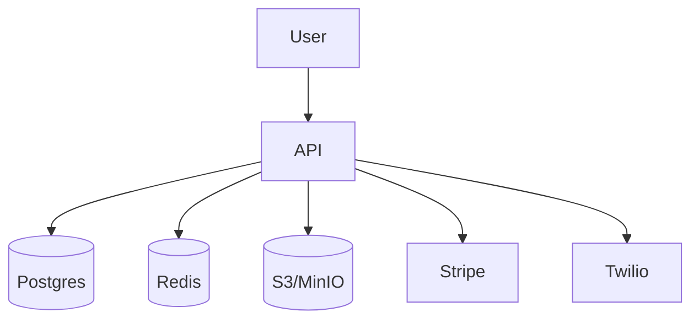

# OBVIO


Simplified ride scheduling for non-emergency medical transport.

## Quick Start

```bash
git clone https://github.com/yourname/OBVIO && cd OBVIO
cp .env.example .env              # fill secrets
docker-compose up -d              # start postgres, redis and minio
npm ci
npm run migrate && npm run seed   # setup database
npm run dev                       # http://localhost:3000
```

## Architecture



## Getting Started

```bash
git clone https://github.com/yourname/OBVIO && cd OBVIO
cp .env.example .env              # fill secrets
# PATIENT_DATA_KEY is required for pgcrypto encryption
npm ci && npx prisma migrate dev  # creates DB
npm run dev                       # http://localhost:3000
```

## Local setup

For environments where Docker Compose isn't available, you can run the API with a
local Postgres instance:

1. Install Postgres:
   ```bash
   brew install postgres
   ```
2. Start Postgres locally:
   ```bash
   ./scripts/local-postgres.sh
   ```
3. Launch the server pointing `DATABASE_URL` at the new database:
   ```bash
   DATABASE_URL=postgresql://localhost:5433/obvio_local npm run dev
   ```

## Replit Deploy

1. [Fork this repo](https://github.com/yourname/OBVIO) and import it into [Replit](https://replit.com).
2. Add environment variables found in `.env.example` using Replit Secrets or run:
   ```bash
   ./scripts/sync-secrets.sh replit
   ```
3. Start the service:
   ```bash
   npm run migrate && npm run seed && npm run dev
   ```

## Fly.io Docker

1. Install the [Fly CLI](https://fly.io/docs/flyctl/install/) and sign in.
2. Provision the app defined in `fly.toml`:
   ```bash
   fly launch --copy-config --no-deploy
   ```
3. Sync secrets:
   ```bash
   ./scripts/sync-secrets.sh fly
   ```
4. Deploy the Docker image:
   ```bash
   fly deploy
   ```

## API reference

See the full [OpenAPI specification](ops/api.yaml) generated via `express-openapi`.

| Method | Path                | Auth         | Description                     |
| ------ | ------------------- | ------------ | ------------------------------- |
| POST   | /signup             | none         | Create patient account          |
| POST   | /login              | none         | Obtain auth token               |
| POST   | /rides              | none         | Book a ride                     |
| GET    | /rides              | bearer       | List rides                      |
| PUT    | /rides/:id/assign   | driver token | Assign driver to ride           |
| PUT    | /rides/:id/complete | driver token | Complete ride and pay out       |
| GET    | /insurance/:id      | bearer       | Retrieve insurance document URL |
| POST   | /webhook/stripe     | secret       | Handle Stripe events            |
| GET    | /metrics            | basic auth   | Prometheus metrics              |
| GET    | /health             | none         | Check database and Stripe       |

## Contributing

See [CONTRIBUTING.md](CONTRIBUTING.md) for guidelines.

## Security

GitHub Advanced Security is enabled. The CI workflow runs CodeQL analysis and
TruffleHog secret scanning on every push to prevent vulnerable dependencies and
leaked credentials.
