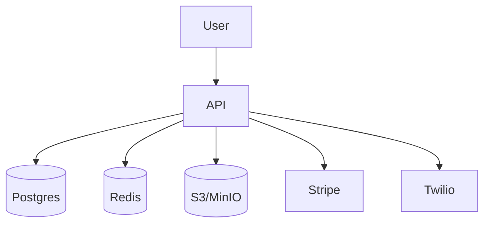

# CHARIO


Simplified ride scheduling for non-emergency medical transport.

## Architecture



## Getting Started

```bash
git clone https://github.com/yourname/CHARIO && cd CHARIO
cp .env.example .env              # fill secrets
npm ci && npx prisma migrate dev  # creates DB
npm run dev                       # http://localhost:3000
```

## Local setup

For environments where Docker Compose isn't available, you can run the API with a
local Postgres instance:

1. Install Postgres:
   ```bash
   brew install postgres
   ```
2. Start Postgres locally:
   ```bash
   ./scripts/local-postgres.sh
   ```
3. Launch the server pointing `DATABASE_URL` at the new database:
   ```bash
   DATABASE_URL=postgresql://localhost:5433/chario_local npm run dev
   ```

## API reference

| Method | Path                | Auth         | Description                     |
| ------ | ------------------- | ------------ | ------------------------------- |
| POST   | /signup             | none         | Create patient account          |
| POST   | /login              | none         | Obtain auth token               |
| POST   | /rides              | none         | Book a ride                     |
| GET    | /rides              | bearer       | List rides                      |
| PUT    | /rides/:id/assign   | driver token | Assign driver to ride           |
| PUT    | /rides/:id/complete | driver token | Complete ride and pay out       |
| GET    | /insurance/:id      | bearer       | Retrieve insurance document URL |
| POST   | /webhook/stripe     | secret       | Handle Stripe events            |
| GET    | /metrics            | basic auth   | Prometheus metrics              |
| GET    | /health             | none         | Check database and Stripe       |

## Contributing

See [CONTRIBUTING.md](CONTRIBUTING.md) for guidelines.

## Security

GitHub Advanced Security is enabled. The CI workflow runs CodeQL analysis and
TruffleHog secret scanning on every push to prevent vulnerable dependencies and
leaked credentials.
