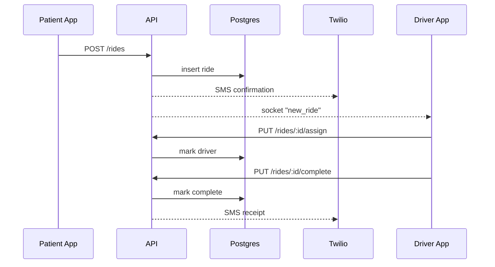

# System Architecture

This document provides an overview of the CHARIO service including request flows, database layout and example API payloads.

## Sequence diagram



## Database schema

The PostgreSQL schema is defined in `schema.sql` and contains the following tables:

- `patients` – registered riders
- `drivers` – available drivers
- `rides` – trip requests linking patients and drivers
- `payments` – Stripe payment intents
- `insurance_docs` – uploaded insurance forms
- `phi_access_logs` – audit log of PHI access

Key indexes exist on `rides.pickup_time` and `rides.status`.

## Request/response examples

### Create a ride

Request:
```bash
POST /rides
Content-Type: application/json

{
  "pickup_time": "2024-12-01T15:00:00Z",
  "pickup_address": "100 Clinic Way",
  "dropoff_address": "200 Wellness Ave",
  "payment_type": "card"
}
```

Response:
```json
{
  "id": "<uuid>",
  "status": "pending",
  "pickup_time": "2024-12-01T15:00:00.000Z"
}
```

### Assign a ride

```bash
PUT /rides/<id>/assign
Authorization: Bearer <token>
```

Returns the updated ride object with `status` set to `confirmed`.
